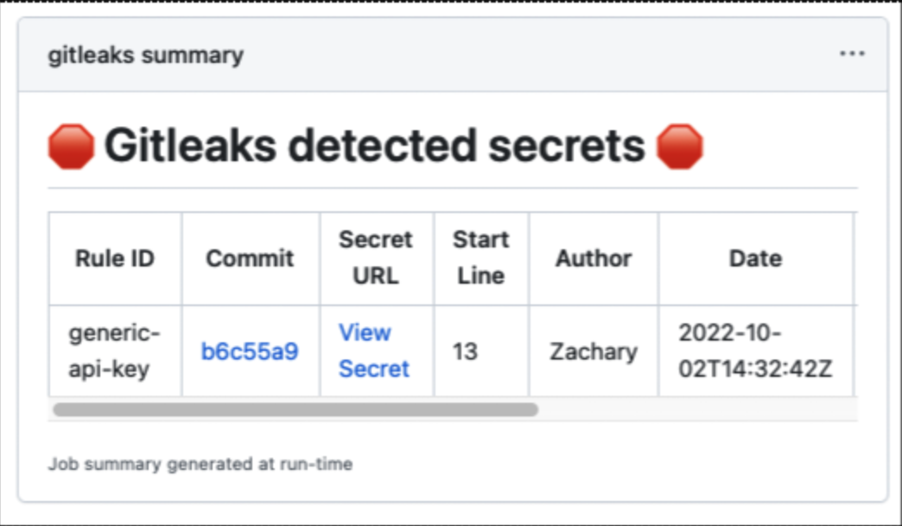
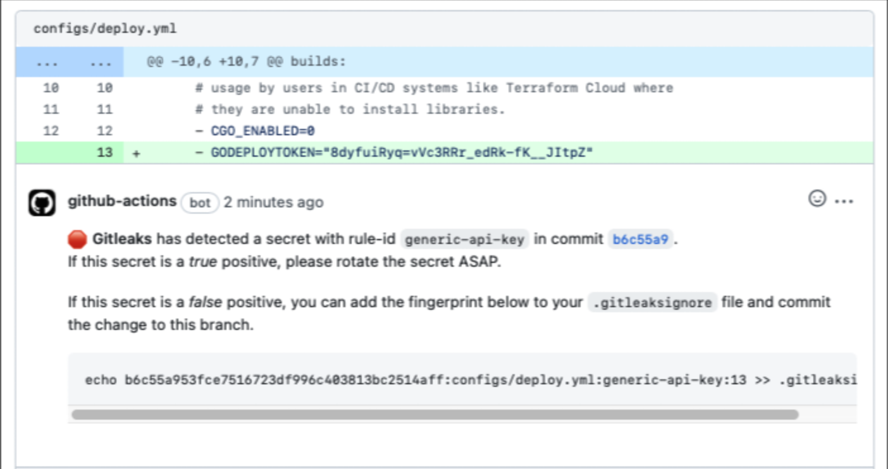

# Step 5: Integrating Gitleaks to CI/CD pipelines with Github Actions

In this final step, we’ll look at how you can integrate Gitleaks into a real-world workflow using GitHub Actions.

One of the main strengths of Gitleaks is that it fits naturally into CI/CD pipelines. By running it automatically on every push or pull request, you can catch secrets before they ever make it into your main branch without relying on developers to remember to scan manually.

Here’s a simple example of what a GitHub Actions workflow for Gitleaks could look like:

```yaml
name: gitleaks
on: [pull_request, push, workflow_dispatch]
jobs:
  scan:
    name: gitleaks
    runs-on: ubuntu-latest
    steps:
      - uses: actions/checkout@v3
        with:
          fetch-depth: 0
      - uses: gitleaks/gitleaks-action@v2
        env:
          GITHUB_TOKEN: ${{ secrets.GITHUB_TOKEN }}
          GITLEAKS_LICENSE: ${{ secrets.GITLEAKS_LICENSE}} # Only required for Organizations, not personal accounts.
```

This Action triggers on both pushes and pull requests. It checks out your code, runs Gitleaks with your configuration file, and fails the build if a secret is found. That means your team won’t be able to merge code that leaks sensitive information, effectively stopping the problem at the source.

If the Action were to find a leak, it populates a summary view that tells you what went wrong:



In pull-requests, the Action comments the line where the secret was leaked:



This kind of integration makes secret scanning part of the development process itself, rather than an afterthought. Developers get instant feedback, pipelines stay secure, and you prevent costly leaks automatically. 🎉